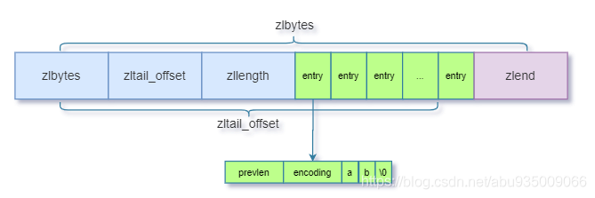

#redis 

    typedef struct redisObject {   
    // 类型    
    unsigned type:4;// string,list,set,zset,hash等
    // 编码    
    unsigned encoding:4;  // int,raw,embstr,ziplist,intset,quicklist,skiplist等  
    // 对象最后一次被访问的时间    
    unsigned lru:REDIS_LRU_BITS;  
    // 引用计数    
    int refcount;   
    // 指向实际值的指针   
    void *ptr;
    } 
##String 字符串 SDS(Simple Dynamic String)
    struct SDS<T> {
    // ...
    T capacity; // 数组容量
    T len; // 数组长度
    byte[] content; // 数组内容
    }   

1.为什么申请空间比实际占用空间大，冗余了很多空位?

字符串支持append修改操作，如果没有冗余空间，那么追加操作必会引起频繁的数组扩容，而扩容是个耗时操作，所以通过空间预分配的方式来解决，即用冗余空间换时间。

2.实际使用长度len字段存在的意义是什么？

我们来用反证法证明，如果没有len来记录字符串长度，那么每次获取字符串长度时，就要调用默认的strlen函数来获取，而这个函数的时间复杂度是O(n)，如果有了len，每次获取长度可以直接访问它，时间复杂度立马降至为O(1)。查询效率迎来质的飞跃，这块跟Arraylist的size原理一样。

    > set key1 2000222222
    OK
    > debug object key1
    Value at:0x7f21f2eadd20 refcount:1 encoding:int serializedlength:5 lru:13142802 lru_seconds_idle:25

为了节省内存空间，会按照实际存储字符串长度类型来选用不同编码。

存储的字符串可以转为long型，则用long类型存储，编码为int

存储的字符串长度不大于44个字节时，用embstr编码

存储的字符串长度大于44个字节时，用raw编码

raw和embstr的区别？
embstr编码: RedisObject的元数据，指针和SDS是连续的，可以避免内存碎片

raw编码: Redis会给SDS分配独立的空间，并用指针指向SDS结构

扩容策略(不超过512MB)

字符串长度小于1MB时，采用加倍策略，ArrayList是1.5倍
字符串长度大于1MB时，采用每次扩容只加固定1MB

##List
版本3.2之前在Redis中使用的是压缩列表ziplist+双向链表linkedlist.
版本3.2之后快速链表quickList

如果添加的字符串元素长度超过默认值64，zip包含的节点数超过默认值512

    typedef struct list{
    //表头节点
    listNode *head;
    //表尾节点
    listNode *tail;
    //链表所包含的节点数量
    unsigned long len;
    // ...
    }
    typedef  struct listNode{
    //前置节点
    struct listNode *prev;
    //后置节点
    struct listNode *next;
    //节点的值
    void *value;  
    }

###zipList
ziplist压缩列表是内存地址连续，元素之间紧凑存储，功能类似链表的一种数据结构。
    
    struct ziplist<T> {
    int32 zlbytes;   // 整个列表占用字节数
    int32 zltail_offset; // 达到尾部的偏移量
    int16 zllength; // 存储元素实体个数
    T[] entries; // 存储内容实体
    int8 zlend; // 尾部标识
    }
    struct entry {
    int<var> prevlen;   // 前一个entry的字节长度
    int<var> encoding;; // 元素类型编码
    optional byte[] content; // 元素内容
    }

为什么用ziplist？

因为普通的链表要附加prev、next前后指针，浪费空间（64位操作系统每个指针占用8个字节），另外每个节点的内存是单独分配，会加剧内存的碎片化，影响内存管理效率。

简单的来说就是用非指针连接的方式实现了双向链表的能力，能从头部和尾部（zltail）双向遍历，没有维护双向指针prev next；而是存储上一个 entry的长度和 当前entry的长度，通过长度推算下一个元素在什么地方。牺牲读取的性能，获得高效的存储空间，因为(简短字符串的情况)存储指针比存储entry长度 更费内存。这是典型的“时间换空间”。只有字段、值比较小，才会用ziplist。

###quickList
是一个ziplist组成的双向链表。每个节点使用ziplist来保存数据。

结合了 zipList 和 linkedList 的优点设计出来的，ziplist会引入频繁的内存申请和释放，而linkedlist由于指针也会造成内存的浪费，而且每个节点是单独存在的，会造成很多内存碎片，所以结合两个结构的特点，设计了quickList。

    struct quicklist {
    quicklistNode *head;   
    quicklistNode *tail;
    long count; // 元素总数
    // ...
    }
    struct quicklistNode  {
    quicklistNode *prev;  
    quicklistNode *next;
    ziplist *zl;// 压缩列表

https://laker.blog.csdn.net/article/details/110636513?spm=1001.2101.3001.6661.1&utm_medium=distribute.pc_relevant_t0.none-task-blog-2%7Edefault%7ECTRLIST%7Edefault-1.no_search_link&depth_1-utm_source=distribute.pc_relevant_t0.none-task-blog-2%7Edefault%7ECTRLIST%7Edefault-1.no_search_link&utm_relevant_index=1